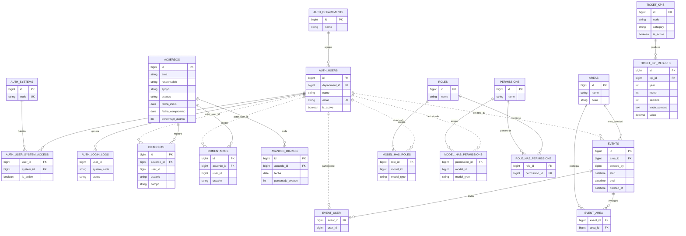
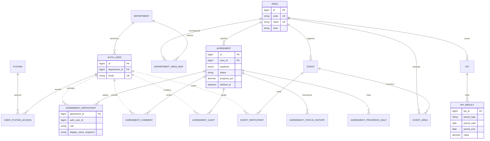

# Auditoría de base de datos — Agenda de Acuerdos

Fecha: 2026-09-21

## Alcance y limitación

Esta auditoría se construyó a partir de migraciones, modelos Eloquent, controladores y consultas del repositorio. Se intentó contrastar el diseño con la instancia configurada mediante `php artisan migrate:status` y `php artisan db:show`, pero el repositorio no contiene un `.env` funcional y Laravel intentó conectarse a `forge`, por lo que no fue posible obtener tamaños, cardinalidades, índices reales, registros huérfanos ni el estado efectivo de las migraciones.

Por tanto:

- Los hallazgos estructurales y de uso de código tienen alta confianza.
- Ninguna tabla debe eliminarse hasta ejecutar las consultas de validación incluidas al final sobre un respaldo reciente.
- Las tablas de `auth_center` y `sistema_tickets` se muestran según las columnas y relaciones observables desde este sistema; no sustituyen la auditoría de sus esquemas completos.

## Resumen ejecutivo

El diseño funciona, pero actualmente reparte la misma realidad entre tres bases y conserva restos del esquema anterior:

1. Los usuarios viven en `auth_center.users`, mientras roles y permisos viven en la base local. Los IDs externos se guardan localmente sin claves foráneas.
2. `acuerdos.area`, `acuerdos.responsable`, `acuerdos.apoyo` y `kpis.category` son textos libres que duplican catálogos y personas.
3. Existen dos implementaciones de KPI: `kpis`/`kpi_valores` locales y `kpis`/`kpi_results` en `sistema_tickets`; el código activo usa la segunda.
4. La aplicación desactiva claves foráneas durante operaciones ordinarias del calendario. Esto permite insertar huérfanos y oculta inconsistencias de diseño.
5. Las tablas pivote del calendario carecen de restricciones únicas, por lo que admiten participantes o áreas duplicados.
6. `acuerdos` mezcla datos fuente con valores derivados (`porcentaje_avance` y métricas de tiempo), y usa el texto `ELIMINADO` como borrado lógico.
7. Hay una credencial de base de datos como valor predeterminado dentro de `config/database.php`. Debe rotarse y retirarse del código/historial como prioridad crítica.

## Inventario lógico

### Base principal de Agenda

| Tabla | Función | Estado observado |
|---|---|---|
| `acuerdos` | Acuerdos, estado y métricas acumuladas | Activa, requiere normalización |
| `bitacoras` | Auditoría de cambios de acuerdos | Activa |
| `comentarios` | Conversación/actividad de acuerdos | Activa |
| `avances_diarios` | Foto diaria del avance | Activa |
| `areas` | Catálogo local de áreas y color | Activa, sin unicidad en `name` |
| `events` | Calendario | Activa |
| `event_user` | Participantes de eventos | Activa, sin FK a usuario y sin unicidad |
| `event_area` | Áreas involucradas en eventos | Activa, sin unicidad |
| `permissions`, `roles` y pivotes Spatie | Autorización propia de Agenda | Activas |
| `users` local | Esquema anterior de autenticación | Candidata a retiro |
| `kpis`, `kpi_valores` locales | Implementación local anterior de KPI | Candidatas a retiro |
| `password_reset_tokens` local | Recuperación del esquema local | Probablemente duplicada |
| `personal_access_tokens` | Tokens Sanctum | Condicional; no se observó emisión de tokens |
| `failed_jobs` | Fallos de colas Laravel | Condicional; conservar si hay workers/colas |

### Auth Center

| Tabla observada | Función |
|---|---|
| `users` | Identidad, contraseña, estado y departamento |
| `departments` | Catálogo organizacional |
| `systems` | Catálogo de aplicaciones |
| `user_system_access` | Acceso de un usuario a una aplicación |
| `login_logs` | Bitácora central de accesos |

### Sistema de tickets/KPI

| Tabla observada | Función |
|---|---|
| `kpis` | Definición de KPI (`code`, `name`, `category`, metas, estado) |
| `kpi_results` | Resultados mensuales y semanales |

## Diagrama actual reconstruido

Las líneas punteadas representan referencias lógicas sin clave foránea verificable.



## Tablas prescindibles o consolidables

“Prescindible” significa candidata después de validar datos, dependencias externas y respaldo; no es una orden de borrado.

| Tabla | Confianza | Propuesta | Condición previa |
|---|---:|---|---|
| `users` de la base local | Alta | Eliminar y retirar sus migraciones de la línea base nueva | Confirmar que autenticación, seeds y procesos externos usan exclusivamente `auth_center.users`; comprobar que no quedan FK locales |
| `kpis` local | Alta | Eliminar | Confirmar que está vacía o migrar cualquier fila no presente en `sistema_tickets.kpis` |
| `kpi_valores` local | Alta | Eliminar junto con `kpis` local | Comparar resultados con `sistema_tickets.kpi_results` |
| `password_reset_tokens` local | Media-alta | Eliminar o no crear en instalaciones nuevas | Confirmar que el broker de contraseñas usa únicamente `mysql_auth` |
| `personal_access_tokens` | Media | Eliminar si Agenda no ofrece API ni emite tokens Sanctum | Buscar consumidores externos, tokens existentes y rutas API antes de retirar `HasApiTokens` |
| `failed_jobs` | Baja | Conservar por defecto | Eliminar solo si se confirma que ningún entorno usa colas persistentes |

No son prescindibles: `bitacoras`, `comentarios`, `avances_diarios`, `event_user` y `event_area`; todas tienen uso activo. `events.area_id` podría consolidarse con `event_area`, pero primero debe definirse si representa al área organizadora. Si esa semántica existe, debe renombrarse a `organizer_area_id`, no eliminarse.

Columnas candidatas a retiro o rediseño:

- `acuerdos.comentarios`: no se observó lectura/escritura funcional; los comentarios activos viven en `comentarios`.
- `acuerdos.area`: reemplazar por `area_id`.
- `acuerdos.responsable` y `acuerdos.apoyo`: reemplazar por una relación de participantes.
- `acuerdos.tiempo_total_dias`, `tiempo_detenido_dias`, `tiempo_efectivo_dias`: son datos derivados. Calcularlos desde transiciones o mantenerlos como snapshot explícito con una política de recálculo.
- `kpi_results.inicio_semana`: cambiar de `TEXT` a `DATE`.

## Hallazgos y recomendaciones

### P0 — Seguridad e integridad

1. Rotar inmediatamente la credencial expuesta como valor predeterminado en `config/database.php`, sustituirla por `env('DB_AREASKPI_PASSWORD')` sin secreto predeterminado y revisar el historial Git.
2. No ejecutar `Schema::disableForeignKeyConstraints()` en solicitudes normales. En una conexión persistente, una excepción puede dejar la sesión sin validación y permitir huérfanos.
3. Unificar el acceso a Auth Center. Actualmente `App\Models\User` usa la conexión `mysql` con tabla calificada `auth_center.users`, mientras `AuthUser` usa `mysql_auth`. Esto presupone que ambas bases viven en el mismo servidor y puede fallar si los hosts difieren.
4. Tratar el ID de Auth Center como identificador externo estable. Si ambas bases no comparten servidor/gestión transaccional, no intentar una FK física: usar integridad por aplicación, reconciliación periódica y eventos de baja/actualización.

### P1 — Normalización e identidad

1. Crear `area_id` en `acuerdos` y migrar por un alias normalizado. Añadir `UNIQUE areas(name)` o, preferiblemente, `areas(code)` único e inmutable.
2. Reemplazar el mapa de nombres de departamento codificado en `User::getAreaAttribute()` por una tabla `department_area_map(department_id, area_id)`.
3. Modelar responsables y apoyos con `acuerdo_participants(acuerdo_id, auth_user_id, role, display_name_snapshot)`. Restricción única sugerida: `(acuerdo_id, auth_user_id, role)`.
4. Mantener `usuario` en comentarios/bitácoras solo como `actor_name_snapshot`. No es redundancia accidental: preserva el nombre histórico si el usuario cambia o desaparece. Renombrarlo aclara su intención.
5. Reemplazar el borrado lógico `area = 'ELIMINADO'` con `deleted_at` en `acuerdos`. El área nunca debe representar el estado de eliminación.
6. Crear un historial explícito `acuerdo_status_history(acuerdo_id, from_status, to_status, reason, changed_by, changed_at)`. La bitácora genérica puede continuar para otros campos.

### P1 — KPI

1. Elegir un solo dueño del dominio KPI. Según el código actual debe ser `sistema_tickets`, o extraerse a un servicio/base KPI; la implementación local está abandonada.
2. Sustituir `kpis.category` por `area_id` o por un `area_code` compartido. Los `LIKE` sobre categorías impiden integridad y degradan índices.
3. Evitar mezclar granularidad mensual y semanal mediante nulos ambiguos. Diseño recomendado: una fila por período con `period_type`, `period_start`, `period_end`, o tablas separadas si las métricas difieren.
4. Agregar una unicidad real por granularidad. Ejemplo lógico semanal: `(kpi_id, period_type, period_start)`; mensual: la misma clave con el primer día del mes.
5. Usar `DECIMAL`, no `DOUBLE`, para metas y valores porcentuales que requieren comparaciones estables.

### P2 — Restricciones e índices

Restricciones recomendadas:

- `areas(code)` y `areas(name)` únicos.
- `event_user(event_id, user_id)` único; puede usar esa pareja como PK y prescindir de `id`.
- `event_area(event_id, area_id)` único; puede usar esa pareja como PK.
- `events`: `end >= start`.
- `acuerdos`: `porcentaje_avance BETWEEN 0 AND 100`, `fecha_compromiso >= fecha_inicio` y `fecha_cierre IS NULL OR fecha_cierre >= fecha_inicio`.
- `avances_diarios`: ya tiene la unicidad correcta `(acuerdo_id, fecha)`; añadir el check de porcentaje.
- `user_system_access(user_id, system_id)` único en Auth Center, si aún no existe.

Índices sugeridos a confirmar con `EXPLAIN` y volumen real:

| Tabla | Índice sugerido | Motivo |
|---|---|---|
| `acuerdos` | `(area_id, estatus, fecha_compromiso)` | filtros del tablero y seguimiento por área |
| `acuerdos` | `(responsable_user_id, estatus, fecha_cierre)` | estadísticas por responsable; omitir si se migra a pivote y ponerlo allí |
| `bitacoras` | `(acuerdo_id, campo, created_at)` | reconstrucción de transiciones |
| `comentarios` | `(acuerdo_id, created_at)` | últimos comentarios y cálculo de actividad |
| `avances_diarios` | `(fecha, acuerdo_id)` adicional | reportes transversales por fecha |
| `events` | `(start, end)` y `(created_by, start)` | rango de calendario y eventos propios |
| `event_user` | `(user_id, event_id)` además de la unicidad inversa | eventos visibles por usuario |
| `event_area` | `(area_id, event_id)` además de la unicidad inversa | eventos visibles por área |
| `model_has_roles` | `(model_type, model_id)` ya existe; revisar orden según consultas | autorización por usuario |
| `kpi_results` | `(kpi_id, year, month, semana)` temporal | consultas actuales; sustituir por clave de período normalizada |

No conviene crear todos los índices a ciegas: primero ejecutar `EXPLAIN ANALYZE`, revisar selectividad y evitar duplicar prefijos cubiertos por otros índices.

## Modelo objetivo propuesto



La línea punteada conceptual hacia `AUTH_USER` significa que los IDs pertenecen a otro límite de datos. Se deben resolver mediante un adaptador/repositorio de identidad, no mediante múltiples modelos contradictorios.

## Propuesta de relación con el nuevo sistema de usuarios

Arquitectura recomendada: Auth Center es la única fuente de identidad y credenciales; Agenda es dueña de sus roles, permisos y datos de negocio.

1. Identidad: todas las referencias locales guardan `auth_user_id` con el mismo tipo que `auth_center.users.id`.
2. Acceso: `auth_center.user_system_access` responde si la persona puede entrar a Agenda.
3. Autorización: roles/permisos específicos permanecen en Agenda, vinculados al `auth_user_id` externo.
4. Organización: `department_area_map` traduce departamentos de Auth Center a áreas de Agenda; se eliminan excepciones por correo y cadenas codificadas.
5. Historial: comentarios, auditorías y eventos guardan `auth_user_id` más un nombre snapshot cuando sea necesario conservar evidencia histórica.
6. Bajas: al revocar acceso, no borrar referencias históricas. Desactivar acceso y limpiar asignaciones operativas futuras mediante un job/evento idempotente.
7. Consistencia: ejecutar una reconciliación diaria que reporte IDs externos inexistentes, usuarios inactivos aún asignados y usuarios con rol local pero sin `user_system_access` activo.

Si las bases están en el mismo servidor MySQL y bajo el mismo ciclo de despliegue, pueden evaluarse FK entre esquemas. Si están en servidores distintos, las FK no son posibles y la estrategia correcta es consistencia eventual, monitoreo y claves naturales/snapshots solo para recuperación, nunca duplicar contraseñas.

## Plan de migración sin interrupción

1. Respaldar y obtener métricas reales; ejecutar las consultas de diagnóstico.
2. Rotar el secreto expuesto y corregir la configuración de conexiones.
3. Crear columnas/relaciones nuevas nullable (`area_id`, participantes, actor IDs claros) e índices únicos en pivotes después de deduplicar.
4. Poblar en segundo plano y generar reporte de valores sin correspondencia.
5. Hacer escritura dual temporal y comparar resultados.
6. Cambiar lecturas al modelo normalizado y vigilar errores/rendimiento.
7. Aplicar `NOT NULL`, checks y unicidades cuando no haya huérfanos.
8. Dejar una versión completa de respaldo y un período de observación.
9. Retirar columnas/tablas antiguas en una migración separada y reversible mediante restauración de respaldo, no mezclada con el backfill.

## Consultas de validación antes de eliminar o restringir

Adaptar nombres de esquema antes de ejecutar.

```sql
-- Inventario y tamaño real
SELECT table_schema, table_name, table_rows,
       ROUND((data_length + index_length) / 1024 / 1024, 2) AS size_mb
FROM information_schema.tables
WHERE table_schema IN ('agenda_acuerdos', 'auth_center', 'sistema_tickets')
ORDER BY table_schema, table_name;

-- Tablas locales candidatas: contenido antes de DROP
SELECT 'users' AS tabla, COUNT(*) AS filas FROM users
UNION ALL SELECT 'kpis', COUNT(*) FROM kpis
UNION ALL SELECT 'kpi_valores', COUNT(*) FROM kpi_valores
UNION ALL SELECT 'password_reset_tokens', COUNT(*) FROM password_reset_tokens
UNION ALL SELECT 'personal_access_tokens', COUNT(*) FROM personal_access_tokens;

-- Áreas duplicadas por mayúsculas/espacios
SELECT UPPER(TRIM(name)) AS area_normalizada, COUNT(*)
FROM areas
GROUP BY UPPER(TRIM(name))
HAVING COUNT(*) > 1;

-- Textos de acuerdo que no resuelven al catálogo de áreas
SELECT DISTINCT a.area
FROM acuerdos a
LEFT JOIN areas ar ON UPPER(TRIM(ar.name)) = UPPER(TRIM(a.area))
WHERE ar.id IS NULL;

-- Pivotes duplicados
SELECT event_id, user_id, COUNT(*) n
FROM event_user GROUP BY event_id, user_id HAVING n > 1;

SELECT event_id, area_id, COUNT(*) n
FROM event_area GROUP BY event_id, area_id HAVING n > 1;

-- Huérfanos locales
SELECT b.id FROM bitacoras b LEFT JOIN acuerdos a ON a.id = b.acuerdo_id WHERE a.id IS NULL;
SELECT c.id FROM comentarios c LEFT JOIN acuerdos a ON a.id = c.acuerdo_id WHERE a.id IS NULL;
SELECT d.id FROM avances_diarios d LEFT JOIN acuerdos a ON a.id = d.acuerdo_id WHERE a.id IS NULL;
SELECT eu.event_id FROM event_user eu LEFT JOIN events e ON e.id = eu.event_id WHERE e.id IS NULL;
SELECT ea.event_id FROM event_area ea LEFT JOIN events e ON e.id = ea.event_id WHERE e.id IS NULL;

-- IDs de usuario externos inexistentes (solo si ambos esquemas son accesibles desde la conexión)
SELECT b.user_id FROM bitacoras b
LEFT JOIN auth_center.users u ON u.id = b.user_id
WHERE b.user_id IS NOT NULL AND u.id IS NULL;

SELECT e.created_by FROM events e
LEFT JOIN auth_center.users u ON u.id = e.created_by
WHERE u.id IS NULL;

SELECT eu.user_id FROM event_user eu
LEFT JOIN auth_center.users u ON u.id = eu.user_id
WHERE u.id IS NULL;

-- Valores inválidos que bloquearían checks
SELECT id, porcentaje_avance FROM acuerdos
WHERE porcentaje_avance NOT BETWEEN 0 AND 100;

SELECT id, fecha_inicio, fecha_compromiso, fecha_cierre FROM acuerdos
WHERE fecha_compromiso < fecha_inicio
   OR (fecha_cierre IS NOT NULL AND fecha_cierre < fecha_inicio);
```

## Criterio de cierre de la auditoría

Para convertir este diagnóstico estático en auditoría completa de producción faltan: DDL real (`SHOW CREATE TABLE`), índices, conteos, huérfanos, duplicados, tamaños, planes `EXPLAIN ANALYZE`, versión de MySQL y políticas de respaldo/retención. Con esas evidencias se puede emitir un script de migración exacto y una matriz final de conservar/migrar/eliminar.
